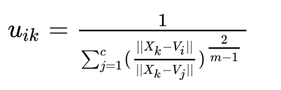
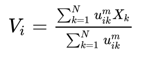
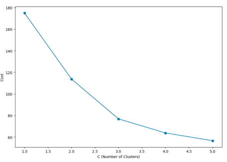

# Fuzzy-C-Means-Clustering

## Overview
Fuzzy C-Means clustering is a fuzzy clustering algorithm that allows data points to belong to multiple clusters to varying degrees. It is an extension of the traditional K-Means algorithm and is useful when dealing with data that may not have clear-cut cluster boundaries. This algorithm is widely used in pattern recognition, image segmentation, and data analysis.

## Algorithm Description
Fuzzy-C-Means clustering involves the following key steps:

### Step 1: Initialization
In the first step of this algorithm, similar to K-Means, we specify the number of clusters we want. Then, for that number, we randomly generate initial cluster centroids.

### Step 2: Iterative Process
The main part of the algorithm is an iterative process that consists of the following:
1. Finding which cluster (or clusters) each data point belongs to.
2. Updating the centroids of clusters based on the data points assigned to them.

For the first task, in C-Means, each cluster is considered as a fuzzy set. As a result, each data point belongs to all clusters to some extent but with different degrees of membership. The degree of membership of the k-th data point to the i-th cluster is calculated from the following equation:

The k-th data point's degree of membership to the i-th cluster, denoted as \(V_{ki}\), is calculated using the equation you provided. This equation considers the closeness of the data point to the center of the i-th cluster relative to its closeness to the centers of other clusters. The parameter \(m\), which should be greater than 1, allows you to control the degree of fuzziness in the membership calculation.

For the second task, you need to calculate the weighted average of the data points that belong to a cluster to update the cluster's centroid. Since all data points are members of all clusters to some extent, you should indeed take a weighted average. This means that you consider the degree of membership of each data point when computing the centroid, giving more weight to data points with higher membership degrees. This weighted average becomes the new centroid for the cluster.

In this way, data points that have a higher degree of membership in a cluster play a more significant role in determining the center of that cluster, which is also logical. So, we perform these two tasks in a loop. For example, we can run this loop for 100 iterations to ensure that the clusters have stabilized, and there are no significant changes.

### Step 3: The cost function and the selection of the optimal centroids (C).
In the previous section, we mentioned that the loop related to the algorithm should continue until the clusters stabilize. The question is, what does it mean for clusters to stabilize, and why is it necessary? The point here is that the two tasks we perform within the loop are effectively minimizing the following cost function in the background:

\[ J = \sum_{i=1}^{K} \sum_{k=1}^{N} V_{ki}^m \cdot \text{distance}(X_k, C_i)^2 \]

Where:
- \( J \) is the total cost.
- \( K \) is the number of clusters.
- \( N \) is the number of data points.
- \( V_{ki} \) is the degree of membership of the k-th data point to the i-th cluster.
- \( m \) is a parameter controlling the fuzziness.
- \( X_k \) is the k-th data point.
- \( C_i \) is the centroid of the i-th cluster.

The goal is to minimize this cost function, which essentially means finding the best arrangement of data points into clusters. As the loop iterates, the degree of membership and the centroids are updated to minimize the cost, and this process continues until there are no significant improvements, indicating that the clusters have stabilized and no major changes are occurring. It ensures that the algorithm has found a suitable clustering solution.

The next point is, what is the impact of the number of clusters on the cost function? If we run the algorithm for different numbers of clusters (C) and plot this value, we will have a chart like this:

As we can see, with an increase in the number of clusters, the cost follows a decreasing trend. This is logical because when the number of cluster centroids increases, the distances of data points to these centroids decrease.

## Use Cases
Fuzzy C-Means clustering has various applications across different domains:

1. Image Segmentation: It is used to segment images into regions or objects with similar characteristics, making it valuable in image processing.
2. Customer Segmentation: Businesses can use fuzzy clustering to group customers based on their purchasing behavior, allowing for targeted marketing strategies.
3. Medical Diagnosis: Fuzzy clustering can help identify patterns in medical data, aiding in disease diagnosis and treatment planning.
4. Natural Language Processing: It is applied in text clustering
5. Anomaly Detection: Fuzzy clustering can be used to detect anomalies in datasets, such as fraud detection in financial transactions.
6. Recommendation Systems: E-commerce platforms use it to recommend products to customers based on their preferences and behavior.
7. Quality Control: In manufacturing, it can help identify product defects by clustering data from quality control sensors.

## License
This documentation is open-source and available under the [MIT License](LICENSE.md). You are free to use, modify, and distribute it according to the terms of the license.

